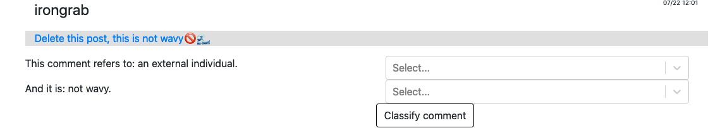
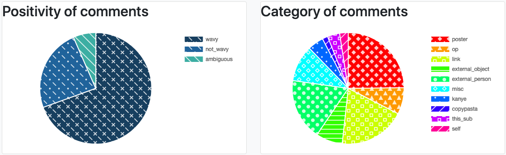

# r/Kanye Wavyness analyzer
An ML project to learn what is 'wavy' - according to reddit.com/r/kanye.
[https://realtime.cannibaltaylor.com/](https://realtime.cannibaltaylor.com/)

## Inspiration
Users in the [kanye subreddit](reddit.com/r/kanye) use the term 'wavy' (or 🌊) to refer to something positively. This is unified among most users, and it allows us to see what is frequently complimented. I started this project to practice fullstack (the webapp) as well as machine learning (the language processing).

## Wavyness in Real Time
The wavy feed will show the five most recent comments that include 'wavy' or 🌊. For each of these, the model attempts to classify it. You can also manually classify a comment to help the model out!

Additionally, you can take a look at the overall breakdown of comments.

Note that the breakdown is only for comments that have been classified by humans.

## Project Structure

I used some simple ML (python's `nltk`) on the backend to try to guess what a comment is referring to, and classify it in to one of 10 categories (see `constants.py`). I am running a bare bones localhost server that answers questions about the data.

The NodeJS server handles two roles:
1. continually collect comments from the subreddit & add them to Mongo (using [redditSnooper](https://github.com/JuicyPasta/reddit-snooper))
2. serve the frontend
It connects to the python over localhost to label the data.

The frontend is located at [https://realtime.cannibaltaylor.com/](https://realtime.cannibaltaylor.com/). Here, you can see some recent comments, and what the classifier labeled them as. You can also classify them, to help out the classifier! There is also a statistics page, in which you can see the most common classifications.

The nodejs server is run with [pm2](https://pm2.keymetrics.io/docs/usage/quick-start/). The python server is run with flask (see the server.py file for running instructions).

The server processes are running on a Digital Ocean droplet, with an NGINX reverse proxy.

## TODOS:
- Consider moving to python on the backend. (mostly done)

### High Priority:
- BACK UP MONGO

### Med Priority:
- In react-select for user classification, user should have a null option.
- Shuffle data before feeding into model.
- Retain mlp's vectorizer for use in classifying comments?
- Python server should be two servers! So they can run independently.
- Python server should restart upon code change.
- get_estimate in app.js has callback hell. Consider changing to request-promise-native?
- Better integrate python & node using rabbitMQ: https://medium.com/@HolmesLaurence/integrating-node-and-python-6b8454bfc272

### Low priority:
- Refactor comment extraction - just get all comments from mongo, check if contains 'category' after.
- Move mlp to seperate dir w/in nlp/
- nlp.py feature extractor should have a more useful error if a comment does not have a specific key.
- Consider graphing change in accuracy w/ more test data: run several times & randomize each time, graph changes
- Reinforce (on client and server) that data is JSON format
- style.css is being duplicated (incl. @ index.jsx, also copies w/ webpack.config)
- Move to PostgreSQL?
- consider splitting the website and scraper
    a) Redis to communicate?
    b) Postgres event notification
    c) Server-sent events: https://www.html5rocks.com/en/tutorials/eventsource/basics/#toc-js-api

